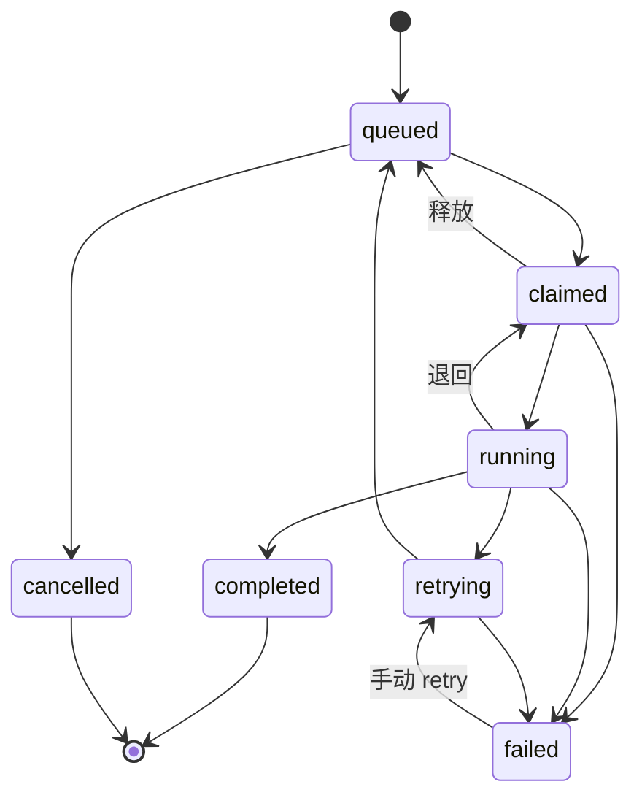

# mio-taskhub

**本地单用户的跨 Agent 任务协调中枢。**

人在这里建任务、看进度；多个 AI 编程助手（opencode / claude code / codex / hermes / WorkBuddy …）通过 MCP 或 HTTP 注册上线、自动领活、上报进度、交回结果。全程零联网、零外部依赖。

| 维度 | 现状 |
|------|------|
| 版本 | v0.2.1（Unreleased：任务文档体系） |
| 后端 | Python ≥3.10 · FastAPI + SQLModel / SQLite(WAL) · 76 模块 / 13,749 行 |
| 对外能力 | **119 个 REST 端点** · **40 个 MCP 工具** · WebSocket 实时广播 · React Web UI |
| 任务文档 | **22 类文档 kind** · **7 件套文档链** · **9 类生命周期状态机** · 质量 lint + 状态门控 + 修订指令 |
| 前端 | React 18 + Vite 5 · 40 文件 / 11,694 行 · 10 个视图 |
| 测试 | **603 个用例**（53 文件 / 7,585 行）· GitHub Actions（windows-latest / py3.12） |
| 部署 | pip 源码 · Docker 多阶段镜像 · Windows 单 EXE 绿色版（免 Python） |

---

## 目录

- [1. 它解决什么问题](#1-它解决什么问题)
- [2. 核心模型](#2-核心模型)
- [3. 快速开始](#3-快速开始)
- [4. 让 Agent 接入](#4-让-agent-接入)
- [5. 能力详解](#5-能力详解)
- [6. 任务文档体系](#6-任务文档体系)
- [7. Web UI](#7-web-ui)
- [8. 可观测性](#8-可观测性)
- [9. 配置项](#9-配置项)
- [10. 运维](#10-运维)
- [11. 开发](#11-开发)
- [12. 文档索引](#12-文档索引)
- [13. 已知限制](#13-已知限制)

---

## 1. 它解决什么问题

多个 AI 助手各自为战时，有三件事靠聊天窗口解决不了：

1. **谁在干什么** —— 没有统一的任务归属与在线状态，重复劳动和空转难以察觉。
2. **干到哪了** —— 长任务断线即失忆，进度、重试、超时无人兜底。
3. **干完的产出在哪** —— 需求、架构、接口契约、测试验收、部署手册散落在各自的会话里，且**写没写全、写没写对无人把关**。

mio-taskhub 把这些收敛成一份**本地 SQLite 里的事实**：任务有状态机与 7 段研发阶段，Agent 有注册与心跳，执行有 Run 与重试，产出有 22 类文档（七件套主链 + 生命周期状态机 + 写时质量 lint）、gitref 与评审记录，变更有一条单调递增的全局事件流。

```
   人                      mio-taskhub                     Agent
   │                          │                              │
   │  建任务 / 记想法          │                              │
   ├─────────────────────────>│  queued · brainstorming       │
   │                          │<─────── register ─────────────┤
   │                          │<─────── claim ────────────────┤  (或 hub 主动分配)
   │                          ├─────── run 上下文 ───────────>│
   │                          │<─────── heartbeat 进度 ───────┤
   │  看板 / 甘特 / 拓扑        │                              │
   │<─────────────────────────┤<─────── submit_result ────────┤
   │                          │  completed · done            │
```

---

## 2. 核心模型

### 2.1 任务状态机（执行维度）



`blocked_failed` 是历史遗留态（不在转移表内，不可达），`ops/data_fixes.py` 会把它批量迁回 `queued` + `block_reason="依赖未满足"`。状态转移由 `TaskState.can_transition` 单点校验，非法转移直接拒绝。

### 2.2 研发阶段（生命周期维度）

任务与状态机正交地挂一条 7 段研发流水线，**阶段不到位就别想被领走**：

```
brainstorming → design → planning → ready → implementing → review → done
                 ↑spec_path   ↑plan_path                        ↑review_result
```

| 进入阶段 | 必须提供的产出物 | 载体 |
|----------|------------------|------|
| `brainstorming` | 需求规格 | `doc_paths['requirement']` |
| `design` | 设计文档 | `doc_paths['spec']`（兼容旧字段 `spec_path`） |
| `planning` | 实现计划 | `doc_paths['plan']`（兼容旧字段 `plan_path`） |
| `implementing` | 变更记录 | `doc_paths['changelog']` |
| `done` | 审查结论 | `review_result` 文本 **或** `doc_paths['review']` |

支持 `advance`（只走相邻一段）与 `move`（任意跳转，保留终态保护与产出物校验）。新建任务默认落在 `brainstorming`。`design` 另外要求至少一条讨论会话（`requires_discussion`）。

门控实现集中在 `api/task_stages.py` 的 `STAGE_ARTIFACT_REQUIREMENTS`，每个阶段的 `document_kinds` 是一个列表（同一阶段可要求多份文档），`GET /api/v1/stages/requirements` 会把这张表连同兼容字段 `document_kind` 一起返回给前端渲染。

### 2.3 任务文档体系（文档维度）

任务与上面两条维度再正交地挂一套**文档体系**，共 22 类 kind、7 件套主链、9 类生命周期状态机。完整机制见 [§6](#6-任务文档体系)。

- **22 类 kind** —— `doc_paths.py` 的 `DOC_KINDS` 是唯一事实源，`doc_paths`（kind→相对路径的 JSON 列）落在 Task 上
- **7 件套文档链** —— `requirement → architecture → spec → data-model → api → test → runbook`
- **9 类生命周期** —— requirement / spec / **api** / decision / plan / test / milestone / incident（8 类文档）+ Task 自身
- **质量闭环** —— 写时 lint 返分数与修法 → 状态门控拦 `review`/`approved`/`done` → `revision` 端点产出可执行的修订指令

### 2.4 想法生命周期

需求不是凭空变成任务的，中间要发酵：

```
new ──> fermenting ──> formed ──> broken_down ──> (任务全部完成后可回流 formed)
                                    │
                                    └──> proposed ──> accepted ──> superseded
                                                     └─> rejected / deprecated
```

后半条是 **ADR（架构决策记录）** 分支：成形想法可演化为 ADR，状态推进后由 `GitSyncWorker` 投影成 `docs/adr/ADR-xxx.md` 落盘。

### 2.5 主要实体

| 实体 | 作用 | 关键字段 |
|------|------|----------|
| `Task` | 任务主体 | state · stage · doc_paths · doc_statuses · depends_on · priority · max_retries · fallback_after · target_agent_type |
| `Run` | 一次执行 | task_id · agent_name · progress · attempt · checkpoint |
| `Agent` | Agent 注册表 | name · status · last_heartbeat（180s 无心跳转 offline） |
| `TaskEvent` | 任务级事件 | event_type · from/to_state · from/to_stage · actor_type |
| `Event` | 全局事件流 | 单调 `seq`，供增量订阅 |
| `Subtask` / `GitRef` / `HistoryEvent` | 拆解与追溯 | 子任务、分支/commit/PR/tag、执行历史 |
| `TaskReview` | 评审记录 | decision(approve/reject/comment) · checklist · summary |
| `Idea` / `IdeaScore` | 想法与评分 | status · project · labels · version |
| `Discussion` / `DiscussionMessage` | 讨论会话 | 可挂 idea 或 task · summary · conclusions |
| `TaskTemplate` / `TaskTemplateVersion` | 任务模板与版本 | 版本快照 + 回滚 |
| `ScheduledJob` | 定时任务 | cron 表达式 · 执行记录 |

---

## 3. 快速开始

### 3.1 Windows 绿色版（免 Python，给非开发用户）

```powershell
powershell -NoProfile -ExecutionPolicy Bypass -File packaging/build.ps1
# 产物：dist/mio-taskhub/（绿色版目录）+ dist/mio-taskhub-绿色版.zip
```

拿到 zip 后：

1. 双击 `mio-taskhub.exe` → 自动开浏览器看板（`http://127.0.0.1:48620`）
2. 双击 `setup-agent.bat` → 自动识别并配置 opencode / claude code / codex / WorkBuddy
3. 重启对应 Agent，说一句「使用 mio-taskhub 领取任务」即可

单 EXE 按参数分派三种角色：默认 = hub，`mcp` = MCP stdio 服务端，`widget` = 置顶浮动看板（可收进托盘）。
数据落在 `%USERPROFILE%\.mio_taskhub\taskhub.db`，换机器复制该文件即可。

### 3.2 源码运行

```bash
pip install -e ".[dev]"          # 或 uv sync

mio-taskhub serve                # http://localhost:48620
mio-taskhub serve --auth         # 启用 Bearer 认证
mio-taskhub serve --port 8081 --host 127.0.0.1
mio-taskhub-mcp                  # 启动 MCP stdio 服务端
```

| 入口 | 地址 |
|------|------|
| Web UI | `http://localhost:48620/` |
| 交互式 API 文档（Swagger） | `http://localhost:48620/docs` |
| ReDoc | `http://localhost:48620/redoc` |
| OpenAPI schema | `http://localhost:48620/openapi.json` |
| 产品宣传页 | `http://localhost:48620/landing` |
| 监控看板 | `http://localhost:48620/dashboard` |
| Prometheus 指标 | `http://localhost:48620/metrics` |
| WebSocket | `ws://localhost:48620/ws` |

> 注意：API 路径前缀是 `/api/v1`，但 **文档页没有该前缀**（`/docs`，不是 `/api/v1/docs`）。

### 3.3 Docker

```bash
docker compose up -d
# 数据持久化在 taskhub-data 卷；健康检查打 /healthz
```

镜像为多阶段构建：Node 20 编前端 → python:3.12-slim 跑后端，前端产物从 stage 1 拷入。

---

## 4. 让 Agent 接入

### 4.1 MCP（推荐）

hub 负责把 HTTP API 包装成 **40 个原生 MCP 工具**，Agent 侧不需要写 curl。

```bash
# MCP 服务端启动命令（任选其一）
mio-taskhub-mcp
python -m mio_taskhub.mcp_server
mio-taskhub.exe mcp          # 绿色版
```

| Agent | 配置方式 |
|-------|----------|
| opencode | `~/.config/opencode/opencode.jsonc` → `mcp.mio-taskhub = {type:"local", command:["python","-m","mio_taskhub.mcp_server"]}` |
| claude code | `claude mcp add mio-taskhub -- python -m mio_taskhub.mcp_server` |
| codex | `~/.codex/config.toml` → `[mcp_servers.mio-taskhub]` |
| WorkBuddy 等 | 按官方方式注册 local stdio server，command 指向同上 |

完整配置片段见 [`docs/MCP_INTEGRATION.md`](docs/MCP_INTEGRATION.md)。

**MCP 工具分组**

| 分组 | 工具 |
|------|------|
| 全局与事件 | `taskhub_status` · `taskhub_poll_events` |
| 生命周期 | `taskhub_register` · `taskhub_agent_heartbeat` · `taskhub_claim` · `taskhub_heartbeat` · `taskhub_submit_result` |
| 任务 CRUD | `taskhub_create_task` · `taskhub_update_task` · `taskhub_list_tasks` · `taskhub_get_task` · `taskhub_cancel_task` · `taskhub_retry_task` |
| 阶段推进 | `taskhub_advance_stage` · `taskhub_move_to_stage` |
| 任务文档 | `taskhub_read_spec` · `taskhub_read_plan` · `taskhub_list_documents` · `taskhub_read_document` · `taskhub_write_document` · `taskhub_scaffold_docs` · `taskhub_set_doc_status` · `taskhub_doc_quality` · `taskhub_doc_revision` |
| 拆解与追溯 | `taskhub_add_subtask` · `taskhub_update_subtask` · `taskhub_add_gitref` · `taskhub_add_history` · `taskhub_add_discussion` |
| 想法工作台 | `taskhub_add_idea` · `taskhub_ideas` · `taskhub_update_idea` · `taskhub_breakdown_idea` · `taskhub_review_idea` · `taskhub_submit_review` · `taskhub_idea_history` |
| 讨论会话 | `taskhub_open_discussion` · `taskhub_discussion_messages` · `taskhub_reply_discussion` · `taskhub_close_discussion` |

**建议写进 Agent 的全局指令**（`AGENTS.md` / `CLAUDE.md`）：

```markdown
## mio-taskhub 任务执行规范
1. taskhub_register 注册；空闲时每约 1 分钟 taskhub_agent_heartbeat 保活
2. taskhub_claim 领任务，拿到 run_id 与任务详情
3. 执行期间周期性 taskhub_heartbeat 上报进度（0-100）
4. 涉及文档时：taskhub_scaffold_docs 起骨架 → taskhub_write_document 填内容
   → taskhub_doc_quality 看分数 → taskhub_doc_revision 拿修订指令改到 errors=0
5. 完成 → taskhub_submit_result(success=true, result="产出描述")
   失败 → success=false 并说明原因
```

### 4.2 CLI 包装器（无 MCP 时的降级路径）

```bash
python packaging/agent_wrapper.py opencode register
python packaging/agent_wrapper.py opencode claim
python packaging/agent_wrapper.py opencode heartbeat <run_id> 50
python packaging/agent_wrapper.py opencode result <run_id> success "完成描述"
python packaging/agent_wrapper.py opencode list
```

### 4.3 自动分配（hub 主动派活）

调度器每 30s 扫一次：若存在**空闲在线 Agent** 与**可领取的 ready 任务**，hub 直接把任务分配给 Agent（写 `task_assigned` 事件，任务转 `claimed`）。

- 分配遵循「高优先级优先 + FIFO + 多 Agent 公平轮转」
- `taskhub_claim` 会优先返回已分配的 run（幂等，重复调用不会重复领）
- 不想被自动分配：注册后不保持 online 心跳，或在任务上设 `target_agent_type` 精确指定执行者
- 目标 Agent 迟迟不来：`fallback_after`（秒）到期后允许其他 Agent 接手

---

## 5. 能力详解

### 5.1 依赖编排

- `depends_on` 是一个任务 ID 数组，依赖未满足时任务被挡在 `queued` 之外
- 依赖满足判定 = `state==completed` **或** `stage==done`（`dependency_satisfied`）
- 依赖全部满足 → 自动放行入队
- 提交依赖图时做**环检测**（`planner.detect_cycle`），环直接拒绝；`/tasks/graph` 也返回 `has_cycle` / `cycle_path`
- 上游失败则依赖永不满足，下游持续停在 `queued`；`block_reason` 字段记录阻塞原因，`composite.py` 的 `composite_status` 会把它渲染成看板上的阻塞标签
- `GET /api/v1/tasks/graph` 返回全图，`GET /api/v1/tasks/{id}/graph` 返回单任务子图，供拓扑视图与关键路径（CPM）计算使用

### 5.2 想法工作台

想法是任务的**上游**，流程刻意做得比任务轻：

1. `taskhub_add_idea` 记下来（`new`）
2. 开讨论会话碰撞（`fermenting`）
3. 成形（`formed`）后 `taskhub_breakdown_idea` 一次性拆成多个任务，子任务之间用 `ref` 互指依赖
4. 任务全部完成后想法可回流 `formed`，继续演进为 ADR

配套还有**想法评分**（`/ideas/{id}/score`、`/ideas/scores`、`/ideas/search`、`/ideas/stats/summary`、`/ideas/{id}/related`、`/ideas/export`）与**每晚自动评审**（`IdeaReviewScanner`）：到期想法自动生成 `task_kind=idea_review` 的评审任务，交给评审 Agent 返回 4 项判定清单。

### 5.3 讨论会话

`Discussion` 可以挂 `idea_id` 或 `task_id`，用户与 Agent 双向发消息。Agent 需要用户拍板时用 `role=ask` 提问，用户回复以 `role=user` 回到同一会话；收尾用 `close_discussion` 写 `summary` + `conclusions`，结论可作为拆解任务的输入。

### 5.4 模板与版本

`TaskTemplate` 把重复性任务固化成模板，每次修改生成一条 `TaskTemplateVersion` 快照，支持按版本回滚（`POST /tasks/templates/{id}/restore/{version}`）。模板可反向从已有任务沉淀（`POST /tasks/templates/from-task/{task_id}`），也可从模板实例化任务（`POST /tasks/from-template/{id}`）。

### 5.5 定时与夜间计划

- **ScheduledJob**：标准 cron 表达式（`croniter`），支持启停/暂停/恢复/手动触发/执行记录，`GET /scheduled-jobs/validate-cron` 可离线校验表达式
- **夜间计划（plan）**：`GET /api/v1/plans/night` 汇总夜间可执行任务，`POST /nightrun/spawn-now` 立即拉起夜间批处理，`NightRunner` 在夜间窗口把计划落成实际任务

### 5.6 记忆网关（Memory Gateway）

把 `mio-intelligence` 的 MCP 工具**代理**成 HTTP 端点，让任意 Agent 不装 MCP 也能读写记忆。单例进程内 MCP 客户端，纯代理不持久化。

| 方法 | 路径 | 代理工具 | 写事件 |
|------|------|----------|--------|
| GET | `/api/v1/memory/health` | 健康检查 | — |
| GET | `/api/v1/memory/query` | `mio_memory_query` | — |
| POST | `/api/v1/memory/record` | `mio_memory_record` | ✓ `memory_record` |
| POST | `/api/v1/memory/policy/check` | `mio_policy_check` | — |
| POST | `/api/v1/memory/observer/ingest` | `mio_observer_ingest` | ✓ `memory_observer_ingest` |
| POST | `/api/v1/memory/experience/reuse` | `mio_experience_reuse` | ✓ `memory_experience_reuse` |

写操作会落一条 `entity=memory` 事件并广播 WS `memory_update`。错误语义统一：MCP 不可达 → `503 memory_unavailable`，超时 → `504 memory_timeout`，RPC 错误 → `502 memory_rpc_error`，参数错误 → `422`。

UX 增强：MCP 子进程死亡后自动重启（默认最多 3 次）、端点限流（默认 60 req/min）、`/health` 返回 `proc_alive`/`respawn_count`/`last_call_ms`/`last_error`、>1KB 响应自动 gzip、错误体统一带 `request_id`/`hint`/`docs`。

规格见 [`docs/taskhub/spec-memory-gateway.md`](docs/taskhub/spec-memory-gateway.md) 与 [`spec-memory-gateway-ux.md`](docs/taskhub/spec-memory-gateway-ux.md)。

### 5.7 ADR 投影到 Git

ADR 状态流转后，`GitSyncWorker` 通过 Outbox 模式把决策记录投影成 `docs/adr/ADR-xxx.md` 落盘（`MIO_TASKHUB_ADR_DIR` 可覆盖目录）。Outbox 事件带自动清理，避免表无限增长。

---

## 6. 任务文档体系

任务文档不是一个自由文本框，而是一套**带类型、带模板、带状态机、带质量门**的一等公民。

- 唯一事实源：`doc_paths.py` 的 `DOC_KINDS`（22 类）
- 落库字段：`Task.doc_paths`（kind→相对路径 JSON）与 `Task.doc_statuses`（kind→生命周期状态 JSON）
- 路径安全：读写都经 `_resolve_within_workspace()` 做 workspace 越界校验，逃逸直接 400；`doc_paths` 约定存相对路径，便于跨机器迁移

### 6.1 22 类文档 kind

| 分组 | kind | 用途 |
|------|------|------|
| **主链（7 件套）** | `requirement` | 需求规格：为什么做 |
| | `architecture` | 架构设计：整体怎么搭 |
| | `spec` | 模块 Spec：本模块怎么设计 |
| | `data-model` | 状态模型：实体、字段、状态机 |
| | `api` | 接口契约：全局约定 + 接口清单 + 明细 |
| | `test` | 测试验收：验收标准 + 用例清单 |
| | `runbook` | 部署运维：环境、步骤、回滚 |
| 工程记录 | `plan` | 实现计划 |
| | `review` | 审查结论 |
| | `changelog` | 变更记录 |
| | `decision` | ADR：为什么这么决定 |
| | `milestone` | 发布了什么 |
| | `incident` | 出了什么问题 |
| 复用资产 | `readme` | 项目/模块说明 |
| | `setup` | 环境搭建 |
| | `userguide` | 使用指南 |
| | `glossary` | 术语表 |
| | `risk` | 风险登记 |
| | `security` | 安全说明 |
| | `research` | 调研笔记 |
| | `retro` | 复盘 |
| | `troubleshooting` | 排障手册 |

三个同步点必须一起改：`doc_paths.DOC_KINDS`（事实源）→ `api/task_documents.py` 的 `DOC_PATTERNS`（路径特征词）→ `web/src/components/DocPanel.jsx` 的 `KIND_META`（展示元数据）。

### 6.2 七件套文档链

`doc_chain.py` 定义主链顺序，并负责生成骨架：

```
requirement → architecture → spec → data-model → api → test → runbook
```

`POST /api/v1/tasks/{id}/docs/scaffold` 一键把缺的骨架补齐：

- **默认不覆盖已有文件**，可以放心反复调用；`overwrite=true` 才重写
- `kinds=["requirement","test"]` 可只生成指定几件
- 每份骨架自带跨链导航头（上游/下游文档链接）和 TODO 占位，并预置 `FR-n` / `TC-n` / `ADR-n` 追溯编号
- 骨架正文按**分点 + 换行**书写，便于直接阅读和增量填充

### 6.3 九类生命周期状态机

`doc_lifecycle.py` 让文档本身成为状态载体，规则是**严格向前**：不许回退、不许跳级、终态不可改判。

| 类型 | 生命周期 |
|------|----------|
| Requirement | `draft → approved` |
| Spec | `draft → review → approved` |
| API（接口契约） | `draft → review → approved` |
| Decision (ADR) | `proposed → accepted → superseded` |
| Plan | `draft → approved → done` |
| Test | `planned → passed / failed` |
| Milestone | `planned → released` |
| Incident | `open → resolved → closed` |
| Task（自身） | `todo → doing → done` |

8 类文档 + Task 自身共 9 条状态机。**接口契约与 Spec 同形**（`draft → review → approved`）——它被纳入生命周期，是为了让 §6.4 的质量门控真正作用于它：接口契约的质量规格是全链最严的，如果它没有生命周期，质量 error 就只能停留在写入提示、无法阻断推进。

- 首次写入某类文档时，`doc_statuses` 自动初始化为该类型的初始态
- 状态推进走 `POST /api/v1/tasks/{id}/doc/{kind}/status`，非法转移被 `validate_transition` 直接拒绝
- `GET /api/v1/tasks/{id}/doc/statuses` 返回每类的当前态与 `allowed_next`，Agent 不用猜下一步

### 6.4 质量保证：写时 lint → 状态门控 → 修订指令

质量不是靠事后审查，而是压到写作阶段。三层依次收紧：

**第一层 · 写时 lint（反馈，不阻断）**

`doc_quality.check_content(kind, content)` 在每次 `PUT /doc` 时同步跑，结果挂在响应里：

| 检查项 | 说明 |
|--------|------|
| 必备章节 | 每类 kind 有 `QUALITY_SPEC`，缺章节记 error |
| 表格行数 | 如「功能需求」「用例清单」要求 ≥1 行有效数据行 |
| 空壳/占位 | 残留 TODO、空章节、正文过短记 warn |
| 分点书写 | 长段落、缺换行记 warn |

评分公式：`score = max(0, 100 - 20*errors - 5*warns)`。

**第二层 · 状态门控（阻断）**

推进到 `review` / `approved` / `done` 时要求 `errors == 0`，否则拒绝。`force=true` 可强行推进，但会落一条事件留痕，便于事后追责。

**第三层 · 修订指令反哺写作（最关键）**

`GET /api/v1/tasks/{id}/doc/{kind}/revision` 返回**可直接执行的修订指令**，而不是一句"质量不达标"：

- 逐条列出问题所在章节
- 每条附上该章节的写作指引（`SECTION_HINTS`）
- 附上该 kind 的模板片段与追溯要求
- Agent 拿到就能改，改完再查一次分，直到 `errors=0` 再过门

配套 `traceability()` 做需求↔测试追溯：校验 `requirement` 里的 `FR-n` 是否在 `test` 中有对应 `TC-n` 覆盖，避免"写了需求没写验收"。

**各 kind 的严格程度不同，其中接口契约最严。** 规格由四个键组成：

| 键 | 含义 | 缺失后果 |
|----|------|---------|
| `sections` | 必需 H2 章节 | error，阻断状态门控 |
| `recommended` | 建议 H2 章节 | warn，只扣分 |
| `min_table_rows` | `{章节: 最少数据行}` | error |
| `detail_rule` | 明细单元必须写全的子块 | error |

`api`（接口契约）按"**事无巨细**"标准设定了全链最严的规格：

- **10 个必需章节** —— 文档信息与范围 · 环境与基础地址 · 认证与鉴权 · 通用响应结构 · 统一错误码 · 字段命名与类型规范 · 幂等性与重试 · 接口清单 · 接口明细 · 变更记录
- **11 个建议章节** —— 版本策略 · 通用请求头 · 分页/排序/过滤 · 时间/数值/空值约定 · 枚举全集 · 限流与配额 · 超时与并发 · 文件上传与下载 · 安全与脱敏 · 兼容性与废弃策略 · 附录
- **逐接口子块强制**（`detail_rule`）—— `接口明细` 下每个 `### <Method> <Path>` 必须含 **请求参数 / 响应字段 / 错误码 / 示例** 四个 `#### ` 子块，前三者各需 ≥1 行数据
- 骨架里内置一份可整块复制的完整接口范例（curl + JSON 示例），并逐节给出写作指引
- 硬要求：每个参数给 位置/类型/必填/默认/约束/示例；每个响应字段给 类型/必填/示例；每个错误码给 触发条件与处理建议；401 与 403 必须区分；「字段缺失」与「显式 null」必须区分；全文禁止「详见代码」「同上」「略」

### 6.5 REST 端点

| 方法 | 路径 | 作用 |
|------|------|------|
| `GET` | `/tasks/{id}/doc` | 读单份文档（kind 或 path） |
| `GET` | `/tasks/{id}/documents` | 列出全部已登记文档 |
| `GET` | `/tasks/{id}/file` | 读任意任务文件 |
| `GET` | `/tasks/{id}/raw` | 读原始文本 |
| `PUT` | `/tasks/{id}/doc` | 写入文档，响应含 `quality` 与 `status` |
| `POST` | `/tasks/{id}/docs/scaffold` | 一键生成七件套骨架 |
| `POST` | `/tasks/{id}/doc/{kind}/status` | 推进生命周期状态（带质量门控） |
| `GET` | `/tasks/{id}/doc/statuses` | 全部 kind 状态 + `allowed_next` |
| `GET` | `/tasks/{id}/doc/{kind}/revision` | 修订指令 |
| `GET` | `/tasks/{id}/doc/quality` | 质量报告 + 追溯矩阵 |

### 6.6 典型闭环

```bash
# 1. 起骨架
POST /api/v1/tasks/{id}/docs/scaffold

# 2. 填内容（分点书写）
PUT  /api/v1/tasks/{id}/doc   {"kind":"requirement","content":"..."}

# 3. 看分数，拿修订指令
GET  /api/v1/tasks/{id}/doc/requirement/revision

# 4. 改到 errors=0 后过门
POST /api/v1/tasks/{id}/doc/requirement/status  {"target":"approved"}

# 5. 阶段推进
POST /api/v1/tasks/{id}/advance
```

Agent 侧对应 9 个 MCP 工具：`taskhub_scaffold_docs` · `taskhub_write_document` · `taskhub_read_document` · `taskhub_list_documents` · `taskhub_set_doc_status` · `taskhub_doc_quality` · `taskhub_doc_revision` · `taskhub_read_spec` · `taskhub_read_plan`。

---

## 7. Web UI

React 18 + Vite 5，单页应用，10 个视图用左侧图标栏切换。生产构建产物由 hub 挂载在 `/`（PyInstaller 打包时嵌进 EXE）。

| 视图 | 看什么 |
|------|--------|
| **工作流** | 7 阶段泳道，任务随阶段流动 |
| **列表** | 表格化清单，批量查看/筛选 |
| **夜间计划** | 夜间批处理计划与执行情况 |
| **拓扑** | 依赖 DAG，链路关系一目了然 |
| **甘特** | 时间轴 + 关键路径（CPM）+ 资源占用 |
| **想法** | 想法池、评分、发酵与拆解入口 |
| **模板** | 任务模板管理、版本对比与回滚 |
| **定时** | cron 任务管理与执行历史 |
| **统计** | 成功率/吞吐/延迟等聚合视图 |
| **记忆** | Memory Gateway 的记忆浏览与检索 |

另有：命令面板（快捷键唤起）、任务详情抽屉、**文档面板**（22 类 kind 分类展示 + 七件套一键起骨架 + 质量分与状态徽标 + markdown 预览）、评审面板、评审队列、依赖图、嵌入式视图（`/#/embed`，可被 Agent 用 iframe 内嵌到产物面板）。

连接状态由 WebSocket 驱动，带连接横幅与实时刷新；接口异常有错误条与错误边界兜底。看板支持拖拽改变状态/阶段，并内置高对比模式。

---

## 8. 可观测性

### 健康与探针

| 端点 | 语义 |
|------|------|
| `GET /healthz` | 存活探针，进程活着就 200 |
| `GET /readyz` | 就绪探针，`SELECT 1` 验 DB；异常返回 503 `{status:"degraded", db:"error"}`，附带备份数量与最新备份时间 |

### 指标 · 看板 · 告警

- `GET /metrics` —— Prometheus 文本格式
- `GET /dashboard` —— 自包含 HTML 监控看板（内置 Chart.js，无外部构建）
- `GET /api/v1/alerts` —— 当前活跃告警
- `GET /api/v1/logs` —— 日志查询，支持 level / logger 过滤

指标族：

```
# 系统（USE）
taskhub_process_cpu_percent / memory_rss_bytes / threads
taskhub_db_pool_size / checked_out / utilization
taskhub_thread_pool_alive / utilization

# 业务
taskhub_task_success_rate / failure_rate / cancel_rate
taskhub_task_throughput_24h / 7d
taskhub_task_retries_total / avg_completion_seconds / p50_seconds
taskhub_agent_utilization

# 依赖延迟（SQLite / Git / MCP）
taskhub_dep_latency_count / errors / avg_ms / p50_ms / p90_ms / p99_ms
taskhub_dep_error_rate

# SLO
taskhub_slo_availability_30d / target / breach
taskhub_slo_error_budget_remaining
```

配套的 Prometheus 抓取配置与 24 条告警规则（critical / warning / info）在 `packaging/`：`prometheus.yml`、`alerts.yml`、`alertmanager.yml`。内置 `AlertManager` 也提供线程/HTTP 健康规则，无需外部依赖即可告警。

### SLO / SLI

| 服务 | 目标 | 窗口 | 错误预算 |
|------|------|------|----------|
| HTTP API 可用性 | 99.9% | 30 天 | 43.2 分钟/月 |
| 任务处理成功率 | 99.0% | 30 天 | 7.2 小时/月 |
| MCP 工具可用性 | 99.5% | 30 天 | 3.6 小时/月 |
| HTTP P50 / P99 | <100ms / <2000ms | 30 天 | — |
| HTTP 5xx 错误率 | <0.1% | 30 天 | — |

错误预算消耗超过 80% 触发告警。完整定义与预算行动策略见 [`docs/SLO-SLI.md`](docs/SLO-SLI.md)。

### 追踪与日志

OpenTelemetry 自动埋点覆盖 FastAPI、SQLAlchemy、httpx；结构化日志带 `trace_id`/`span_id` 关联，可由 `/api/v1/logs` 或落盘日志反查链路。

---

## 9. 配置项

全部通过环境变量配置，均有默认值，**不配也能跑**。

### 核心

| 变量 | 默认 | 说明 |
|------|------|------|
| `MIO_TASKHUB_DB` | `~/.mio_taskhub/taskhub.db` | SQLite 数据库路径 |
| `MIO_TASKHUB_PORT` | `48620` | 监听端口（绿色版/hub/widget 均读） |
| `MIO_TASKHUB_URL` | `http://127.0.0.1:48620/api/v1` | 客户端侧 hub 地址（MCP、夜间运行器读） |
| `MIO_TASKHUB_TOKEN` | 空 | Bearer token；服务端与客户端共用 |
| `MIO_TASKHUB_RATE_LIMIT` | `120` | 全局 API 限流（req/min/IP） |
| `MIO_TASKHUB_ADR_DIR` | `<CWD>/docs/adr` | ADR 落盘目录 |
| `MIO_TASKHUB_WIDGET_NO_TRAY` | — | `1` 时浮动面板不进托盘 |

### 记忆网关

| 变量 | 默认 | 说明 |
|------|------|------|
| `MIO_MEMORY_COMMAND` | `uv` | MCP server 启动命令 |
| `MIO_MEMORY_ARGS` | `run mio-intelligence` | 启动参数（空格分隔） |
| `MIO_MEMORY_MAX_RESPAWN` | `3` | 子进程自动重连次数上限 |
| `MIO_MEMORY_RATE_LIMIT` | `60` | 每分钟每端点请求数 |
| `MIO_MEMORY_DIR` | — | 记忆存储目录 |

### 想法评审 / 推进引擎

| 变量 | 默认 | 说明 |
|------|------|------|
| `MIO_IDEA_REVIEW_ENABLED` | `1` | 总开关 |
| `MIO_IDEA_REVIEW_INTERVAL_MIN` | `1440` | 距上次评审多久再评（24h） |
| `MIO_IDEA_REVIEW_INITIAL_DELAY_MIN` | `60` | 创建后首评冷却（分钟） |
| `MIO_IDEA_ADVANCE_ENABLED` | `1` | 想法推进引擎开关 |
| `MIO_IDEA_ADVANCE_SCAN_MIN` | `1` | 扫描间隔（分钟） |
| `MIO_IDEA_ADVANCE_REMIND_MIN` | `1440` | 无进展兜底提醒周期（24h） |

---

## 10. 运维

### 后台线程

7 个守护线程由 `ThreadRegistry` 统一注册、按**反向顺序**优雅关停，避免关停时互相踩踏：

| 线程 | 职责 |
|------|------|
| `heartbeat` | 扫描超时的 Run（默认 120s），标记超时并触发重试/失败 |
| `scheduler` | 每 30s 扫描到期任务与空闲 Agent，自动分配 |
| `idea-review` | 想法发酵到期自动生成评审任务 |
| `backup` | SQLite 在线备份，默认每小时一次，保留 31 份 |
| `git-sync` | ADR Outbox 投影到 Git 目录 |
| `night-runner` | 夜间计划窗口拉起 |
| `cron-engine` | 定时任务调度 |

### 备份与恢复

备份落在 `~/.mio_taskhub/backups/`，使用 SQLite Online Backup API 做一致性快照（不是文件拷贝），恢复时替换 `taskhub.db` 即可。`/readyz` 会返回备份数量与最新备份时间。

### 认证

```bash
mio-taskhub serve --auth
```

- 服务端 token 优先取 `MIO_TASKHUB_TOKEN`，其次 `--token`，都未设置则自动生成并打印
- 只有 `/api/*` 前缀需要认证，Web UI 与 `/docs` 免认证（本地单用户场景）
- 客户端（MCP 服务、`agent_wrapper.py`）设 `MIO_TASKHUB_TOKEN` 后自动带 `Authorization: Bearer <token>`
- WebSocket 连接时传 `?token=<token>` 或 Bearer 头

---

## 11. 开发

### 目录结构

```
mio_taskhub/
├── main.py              # 应用装配：lifespan、中间件、路由挂载、CLI
├── models.py            # 全部 ORM 模型 + 状态机枚举（唯一权威定义）
├── db.py                # engine / session / WAL / 连接检查
├── migrations.py        # 轻量迁移
├── mcp_server.py        # 40 个 MCP 工具（_tool 装饰器工厂）
├── middleware.py        # RequestID + 限流
├── events.py            # 全局事件流 + WebSocket 广播
├── background.py        # 心跳扫描 / 调度器 / ThreadRegistry
├── dependency.py        # 依赖满足判定 + depends_on 归一化
├── composite.py         # 状态×阶段合成展示（含 block_reason 标签）
├── planner.py           # detect_cycle 环检测 + 夜间计划编排
├── doc_paths.py         # 22 类文档 kind 唯一事实源
├── doc_chain.py         # 七件套文档链 + 骨架模板
├── doc_lifecycle.py     # 9 类文档生命周期状态机（8 类文档 + Task）
├── doc_quality.py       # 质量 lint + 追溯 + 修订指令
├── seed.py              # 演示数据
├── memory_store.py      # 记忆网关客户端与指标
├── api/                 # 26 个路由模块（119 个端点）
├── workflow/            # state_machine / transitions
├── scheduling/          # cron_engine / scheduler / night_runner
├── ideas/               # idea_prompts / idea_review
├── ops/                 # backup / git_sync / data_fixes
└── observability/       # metrics / alerts / dep_metrics / otel / logging_config / report

web/src/                 # React SPA（components/ 含全部视图）
tests/                   # 603 个用例
docs/                    # 规格、ADR、审计报告、HOWTO
packaging/               # 构建脚本、setup 脚本、Prometheus 配置、WorkBuddy skill
```

### 测试

```bash
.venv/Scripts/python.exe -m pytest tests/ -q          # Windows
pytest tests/ -q                                      # 其它平台
```

测试通过 `MIO_TASKHUB_DB` 指向临时库做隔离，CI 会跳过不稳定的 `test_two_agents_race`（该用例已用 QueuePool 修复，稳定性仍在观察）。

文档体系专项用例：`tests/test_doc_chain.py`（骨架）、`tests/test_doc_lifecycle.py`（状态机）、`tests/test_doc_quality.py`（质量与门控）、`tests/test_task_doc_paths.py`（22 类 kind）。

```bash
cd web && npm run build       # 构建前端（hub 从 web/dist 读取）
cd web && npm run dev         # 前端热更新开发
```

### 打包

唯一打包 spec 是根目录 `mio-taskhub.spec`，**不要在别处复制副本**。一键脚本 `packaging/build.ps1` 依次执行：`npm run build` → PyInstaller → 复制 setup 脚本/使用说明/WorkBuddy skill/widget 入口 → 压缩 zip。

踩过的坑（改打包时务必注意）：

- 统一入口是 `packaging/run.py`，按 `sys.argv[1]` 分派 hub / mcp / widget
- 无黑框模式（`console=False`）下 stdout 为 `None`，`run.py` 需重定向到日志文件，否则 uvicorn 日志配置会崩；MCP 分支走 stdio 不做重定向
- `.ps1` 必须存为 **UTF-8 with BOM**，否则 PowerShell 5.1 按 ANSI 读取中文会解析失败
- 排除重型依赖（torch/pandas/scipy 等）见 spec 的 `excludes`，否则体积会膨胀到 GB 级
- 打包目标为 Windows 64 位；Mac/Linux 需在对应系统重打

---

## 12. 文档索引

| 文档 | 内容 |
|------|------|
| [`docs/HOWTO.md`](docs/HOWTO.md) | opencode 接入指南、打包维护要点、想法同步流程 |
| [`docs/MCP_INTEGRATION.md`](docs/MCP_INTEGRATION.md) | 各 Agent 的 MCP 配置、工具清单、事件订阅、手动验证 |
| [`docs/SLO-SLI.md`](docs/SLO-SLI.md) | SLI/SLO 定义、告警规则、错误预算管理 |
| [`docs/taskhub/`](docs/taskhub/) | Memory Gateway 设计与 UX 增强的 spec/plan |
| [`docs/adr/`](docs/adr/) | 架构决策记录（含索引 README） |
| [`docs/superpowers/`](docs/superpowers/) | 各特性的设计与实现计划（按日期归档） |
| [`docs/architecture-audit-v3-2026-09-10.md`](docs/architecture-audit-v3-2026-09-10.md) | 最新架构审计（评分 80/100） |
| [`CHANGELOG.md`](CHANGELOG.md) | 版本变更记录 |
| [`packaging/使用说明.txt`](packaging/使用说明.txt) | 面向非开发用户的图文说明 |

---

## 13. 已知限制

- **单用户本地服务**：认证只有单 Bearer token，没有多租户与权限体系
- **SQLite 并发上限**：WAL + QueuePool 足以支撑单机多 Agent，但规模继续增长需迁移 Postgres
- **God File 残留**：`mcp_server.py`（643 行）与 `background.py`（580 行）仍是最大的两个文件；MCP 层本质是薄代理，理想方案是从 OpenAPI spec 自动生成
- **文档质量 lint 是启发式的**：靠章节标题与表格行数做结构性校验，判断不了内容是否真的对。真正的内容审查仍需人或 Agent 阅读
- **阶段推进不校验接口契约**：`api` 已纳入生命周期（`draft → review → approved`），空心的接口契约无法推进到 `review`；但它仍**不在任何阶段的 `document_kinds` 里**，所以 `advance`/`move` 阶段时不会检查接口契约是否已批准。要变成硬约束需把 `api` 挂进阶段门槛（会改变现有任务工作流）
- **文档 kind 三处同步点**：新增一类 kind 要同时改 `doc_paths.py` / `DOC_PATTERNS` / `KIND_META`，漏改会导致前端不显示（缺自动一致性测试）
- **Windows 优先**：绿色版打包与 setup 脚本只覆盖 Windows；Docker/源码路径跨平台可用
