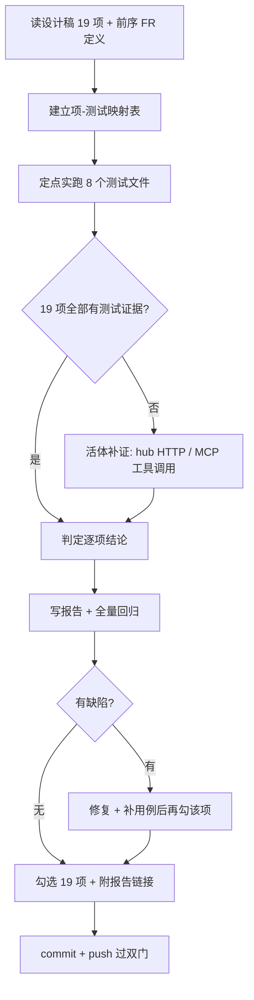

# 模块 Spec — P4 验收清单全量核对执行（task eb248b6a）

## 文档信息

| 项 | 值 |
|---|---|
| 文档版本 | v1.2 |
| 最后更新 | 2026-09-27 23:37 |
| 状态 | approved |
| 负责人 | opencode（mio-taskhub） |
| 适用范围 | 本任务（task eb248b6a）的「19 项验收清单逐项核对」执行规格：核对步骤、证据标准、判定与勾选闭环。**不含**业务功能设计——被核对对象为 P0~P3 已交付能力（FR-1~FR-29），本任务不改其字段模型与端点契约 |
| 上游设计 | docs/taskhub/design-idea-landing.md（v1.3 冻结，验收清单 19 项） |
| 需求基线 | docs/taskhub/eb248b6a/requirement.md（FR-30~FR-33） |
| 产出物 | docs/taskhub/acceptance-audit-p4.md（核对报告） |

## 1. 模块职责与边界

- 做什么：
  - 把设计稿「✅ 验收清单」19 项逐条落到**可复跑证据**（测试用例名 + 实跑结果，或活体调用/操作记录）；
  - 对无自动化覆盖的项（MCP 透传）执行真实工具调用取证；
  - 产出核对报告（19 行证据表 + 缺陷清单/无缺陷声明 + 全量回归结果）；
  - 核对通过后勾选设计稿 19 个复选框、附报告链接、提交推送（过 pre-push 文档门/FR 门）。
- 不做什么：
  - 不加功能、不改字段模型、不改既有端点契约（FR-32/FR-33 边界）；
  - 不重构设计稿正文（只勾选清单 + 附链接）；
  - 不做「成功标准结构化」（v1.3 已裁决不做）；
  - 不并 master（分支叠 `task-d4bdf530`）。

## 2. 输入 / 输出

- 输入：
  - 设计稿验收清单 19 项（`docs/taskhub/design-idea-landing.md` L335-L353）；
  - 前序需求 FR-1~FR-29 定义（`requirement-idea-landing-p0/p1/p2/p3.md`）作为每项的语义来源；
  - 测试库：`tests/test_ideas_api.py`、`test_idea_cockpit.py`、`test_idea_assumptions.py`、`test_review_mode.py`、`test_next_action.py`、`test_idea_topology_p3.py`、`test_idea_retrospective_p3.py`、`test_assumption_links_p3.py`；
  - 活体环境：本机常驻 hub `http://127.0.0.1:48620`（`GET/POST/PATCH /api/v1/ideas*`、`POST /api/v1/discussions*`）与 MCP 工具 `taskhub_open_discussion` / `taskhub_close_discussion`。
- 输出：
  - 报告 `docs/taskhub/acceptance-audit-p4.md`（Markdown，19 行证据表 + 缺陷清单 + 全量回归结果）；
  - 设计稿 19 个 `- [x]` 勾选 + 清单尾报告链接段；
  - 提交（引用 FR-30~FR-33）与 push 结果；活体探测记录（idea 探测件已归档、讨论已合法关闭留痕）。

## 3. 依赖

- 上游模块：
  - taskhub HTTP API（读 idea/cockpit/discussion；写探测件与讨论）；
  - taskhub MCP server（`mio_taskhub/mcp_server.py` 工具签名即 FR-23 的核对点）；
  - pytest 测试库与 `conftest.py` 夹具（独立 SQLite 测试库，与常驻 hub 库隔离）。
- 外部库：
  - pytest（实跑）、Invoke-WebRequest（活体 HTTP 调用的最简客户端）、前端构建产物（P3 已绿，本任务不重跑 FE 用例）。

## 4. 详细设计

核对以「项 → 证据 → 结论」三段式推进，总流程：

- 文件清单：
  - 新增 `docs/taskhub/acceptance-audit-p4.md`（报告）；
  - 新增 `docs/taskhub/eb248b6a/{requirement,plan,spec,api}.md`（本任务文档链）；
  - 修改 `docs/taskhub/design-idea-landing.md`（19 项勾选 + 链接段）；
  - 业务代码：**零改动**（无缺陷）。
- 判定规则（每项结论仅三种）：
  - 通过：测试实跑绿（给出用例名+批次结果）或活体记录含实际响应片段；
  - 不通过：证据与断言不符 → 转 FR-33 处置（修复 + 补用例）；
  - 无自动化证据项：必须活体取证，不允许「读代码推测」充当证据（例外：前端无 JS 单测框架时按计划以**代码断言 + 构建绿**为证并显式标注方法）。
- 证据标准（可复核性）：测试证据须能用 `pytest <nodeid>` 独立复跑；活体证据须写出请求、实际响应关键片段、对象 id。

## 5. 异常与边界情况

| 场景 | 处理方式 |
|------|---------|
| 常驻 hub 无存量想法（NULL 老数据不可复现） | 活体改为「新建最小 idea → 读回归一结果」，NULL 归一断言由单测直接构造 NULL 行覆盖；报告中显式说明该分工 |
| MCP 工具不可用 | 该项（FR-23）改用 API 层等价断言 + 记录 MCP 不可用告警；若工具可用则必须活体取证 |
| 活体探测产生脏数据（探测 idea / 探测讨论） | 核对后清理：idea 置 `archived`（`change_reason=p4-audit-probe-cleanup`）；讨论以合法结构化 review 关闭（留痕可回读，不删除） |
| 定点测试与全量回归并发抢测试库 | 串行执行：定点批次完成后才启动全量（同一 SQLite 测试库，不并发） |
| 全量回归数低于基线（924 passed + 1 skipped） | 视为回归缺陷 → 定位修复后再勾选「全量 pytest 绿」（FR-33） |
| pre-push 文档门要求 spec/api/plan 已 approved | 本任务按文档链补齐 spec/api 并推进 approved（plan 已 approved）；文档门不通过不得 `--no-verify` 绕过 |
| FR 门对勾选行引用的 FR-n（如 FR-26/FR-27/FR-28）判存在性 | 本任务 requirement 已枚举 FR-1~FR-29 全集 + FR-30~FR-33，引用均可追溯 |
